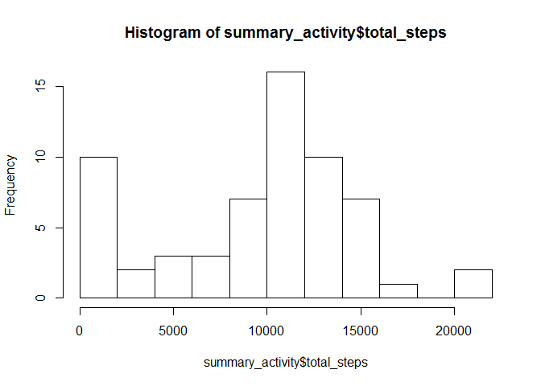
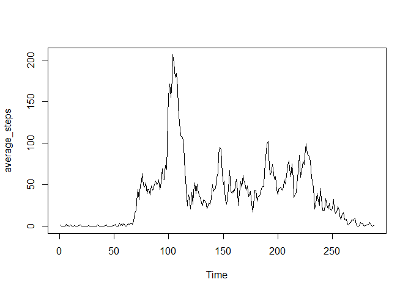
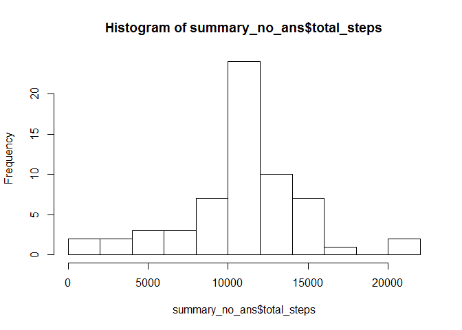
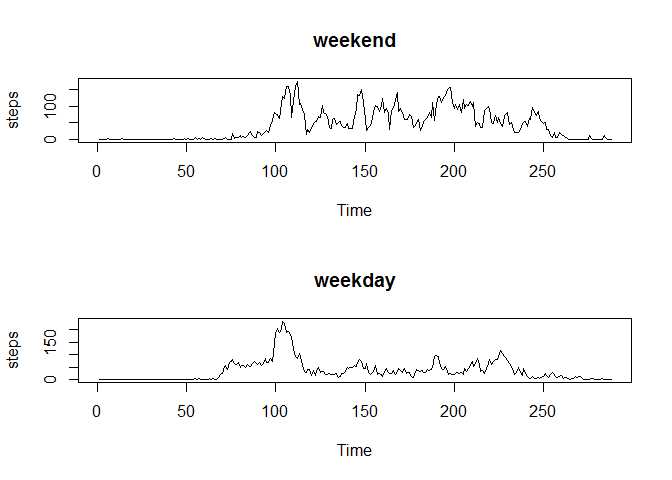

# Reproducible Research: Peer Assessment 1


### Loading and preprocessing the data

#### 1. Load the data (i.e. read.csv())

Show any code that is needed to


```r
zipname <- paste(getwd(), "activity.zip", sep = "/")
download.file(url = "https://d396qusza40orc.cloudfront.net/repdata%2Fdata%2Factivity.zip", zipname)

unzip(zipname, overwrite = TRUE)
filename <- paste(getwd(), "activity.csv", sep = "/")

activity <- read.csv(filename)
```

#### 2. Process/transform the data (if necessary) into a format suitable for your analysis


```r
dates_activity <- group_by(activity, date)
```

### What is mean total number of steps taken per day?

For this part of the assignment, you can ignore the missing values in the dataset.

#### 1. Calculate the total number of steps taken per day


```r
summary_activity <- summarize(dates_activity, total_steps = sum(steps, na.rm = TRUE))
head(summary_activity)
```

```
## # A tibble: 6 × 2
##         date total_steps
##       <fctr>       <int>
## 1 2012-10-01           0
## 2 2012-10-02         126
## 3 2012-10-03       11352
## 4 2012-10-04       12116
## 5 2012-10-05       13294
## 6 2012-10-06       15420
```

#### 2. Make a histogram of the total number of steps taken each day


```r
hist(summary_activity$total_steps, breaks = 15)
```

<!-- -->

#### 3. Calculate and report the mean and median of the total number of steps taken per day


```r
mean(summary_activity$total_steps)
median(summary_activity$total_steps)
```

The mean of of the total number of steps taken per day is 9354.2295082.
The median of of the total number of steps taken per day is 10395.

### What is the average daily activity pattern?


#### 1.Make a time series plot of the 5-minute interval (x-axis) and the average number of steps taken, averaged across all days (y-axis)


```r
interval_activity <- group_by(activity, interval)
steps_interval <- summarize(interval_activity, average_steps = mean(steps, na.rm = TRUE))
average_steps <- ts(steps_interval$average_steps)
plot.ts(average_steps)
```

<!-- -->

#### 2.Which 5-minute interval, on average across all the days in the dataset, contains the maximum number of steps?


```r
interval_activity <- group_by(activity, interval)
steps_interval <- summarize(interval_activity, average_steps = mean(steps, na.rm = TRUE))
result <- steps_interval %>% filter(average_steps == max(average_steps))
result
```

```
## # A tibble: 1 × 2
##   interval average_steps
##      <int>         <dbl>
## 1      835      206.1698
```

Interval **835** contains the maximum steps (average across all the days in the dataset).  

### Imputing missing values

#### 1.Calculate and report the total number of missing values in the dataset (i.e. the total number of rows with NAs)


```r
sum(is.na(activity$steps))
```

There are **2304** rows with NAs.

#### 2.Devise a strategy for filling in all of the missing values in the dataset. 

Replace the NAs with the corresponding average for that interval.

#### 3.Create a new dataset that is equal to the original dataset but with the missing data filled in.


```r
no_ans <- merge(activity, steps_interval)
no_ans$steps[is.na(no_ans$steps)] <- no_ans$average_steps[is.na(no_ans$steps)]
no_ans <- no_ans[,c("steps","date","interval")] %>% arrange(date, interval)
head(no_ans)
```

```
##       steps       date interval
## 1 1.7169811 2012-10-01        0
## 2 0.3396226 2012-10-01        5
## 3 0.1320755 2012-10-01       10
## 4 0.1509434 2012-10-01       15
## 5 0.0754717 2012-10-01       20
## 6 2.0943396 2012-10-01       25
```

#### 4.Make a histogram of the total number of steps taken each day and Calculate and report the mean and median total number of steps taken per day. Do these values differ from the estimates from the first part of the assignment? What is the impact of imputing missing data on the estimates of the total daily number of steps?


```r
dates_no_ans <- group_by(no_ans, date)
summary_no_ans <- summarize(dates_no_ans, total_steps = sum(steps, na.rm = TRUE))
hist(summary_no_ans$total_steps, breaks = 15)
```

<!-- -->

The mean of of the total number of steps taken per day is 1.0766189\times 10^{4}.
The median of of the total number of steps taken per day is 1.0766189\times 10^{4}.

The histogram now shows a much greater frequency in the center (around the mean). Using the interval means to replace NAs caused this effect.

### Are there differences in activity patterns between weekdays and weekends?

#### 1.Create a new factor variable in the dataset with two levels - "weekday" and "weekend" indicating whether a given date is a weekday or weekend day.


```r
activity_wd <- mutate(activity, weekday = as.factor(ifelse(substr(weekdays(as.Date(date, format = "%Y-%m-%d")),1,1) == "z", "weekend", ifelse (substr(weekdays(as.Date(date, format = "%Y-%m-%d")),1,1) == "s", "weekend", "weekday"))))

class(activity_wd$weekday)
```

```
## [1] "factor"
```


#### 2. Panel plot containing a time series plot of the 5-minute interval (x-axis) and the average number of steps taken, averaged across all weekday days or weekend days (y-axis). 


```r
par(mfrow=c(2,1))

interval_activity_we <- group_by(activity_wd %>% filter(weekday == "weekend"), interval)
steps_interval_we <- summarize(interval_activity_we, average_steps = mean(steps, na.rm = TRUE))
steps <- ts(steps_interval_we$average_steps)
plot.ts(steps, main = "weekend")

interval_activity_wd <- group_by(activity_wd %>% filter(weekday == "weekday"), interval)
steps_interval_wd <- summarize(interval_activity_wd, average_steps = mean(steps, na.rm = TRUE))
steps <- ts(steps_interval_wd$average_steps)
plot.ts(steps, main = "weekday")
```

<!-- -->

